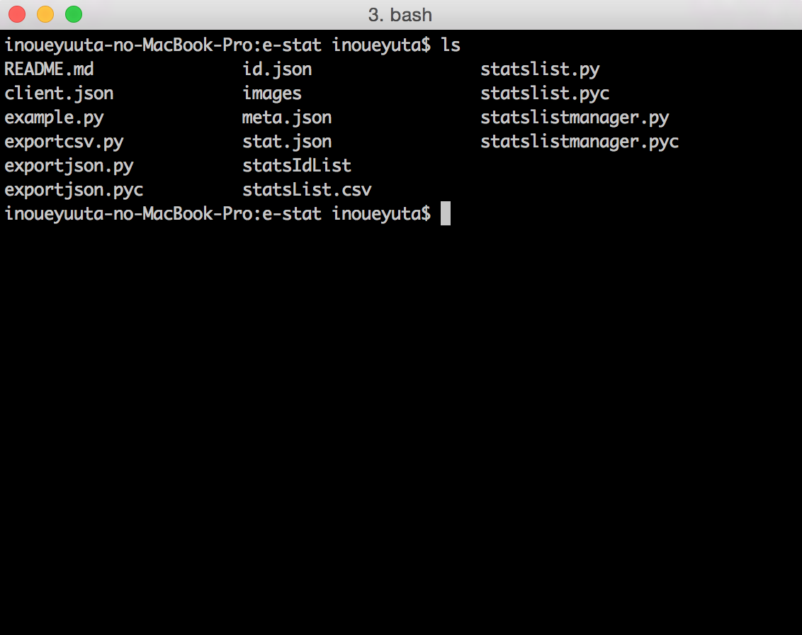
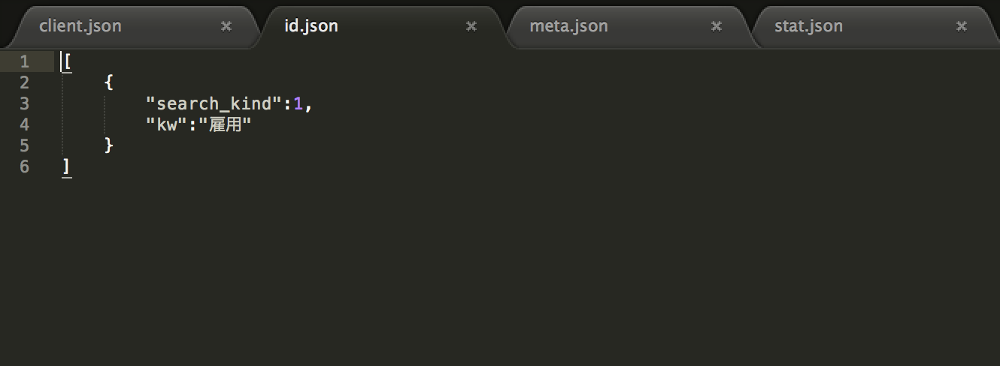
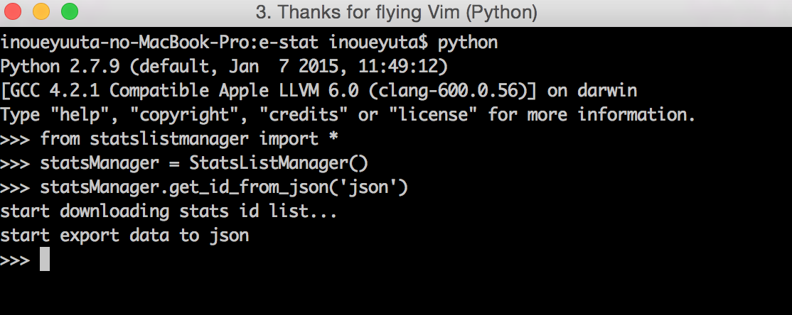
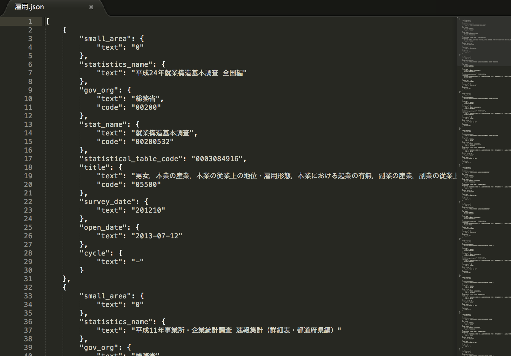
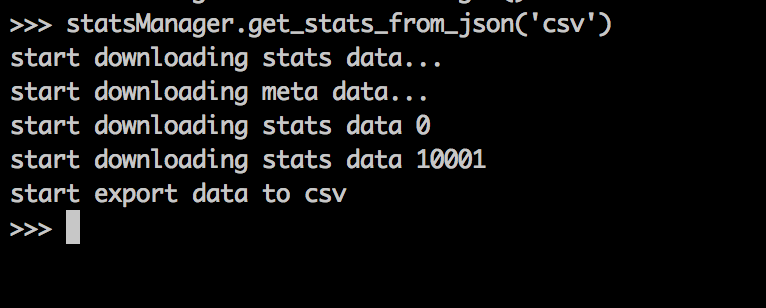
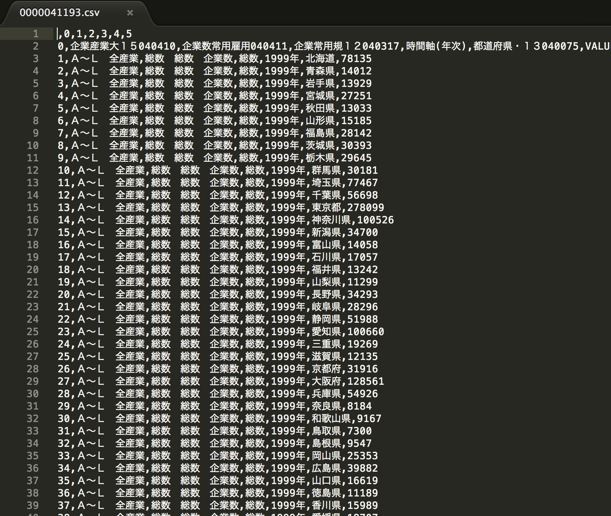

#e-stat
====

Overview

## Description
e-stat（政府統計の総合窓口）から情報を取得するためのライブラリです
http://www.e-stat.go.jp/SG1/estat/eStatTopPortal.do

## Requirement
### module
* BeautifulSoup4
* lxml
* pandas

### file
データ取得のために利用するため以下のファイルを用意してください
* client.json
* id.json (統計表IDの一覧を取得するための情報を記入)
* meta.json（メタ情報の一覧を取得するための情報を記入）
* stat.json（統計情報の一覧を取得するための情報を記入）

```client.json
{
	"appId":"サイトにて取得したappId"
}
```
```id.json
[
	{
		"search_kind":1,
		"kw":"雇用"
	},... //検索条件をまとめて記入
]
```
```meta.json
[
	{
		"statistical_table_code":"0000041193" // 取得するメタ情報の統計表IDを記入
	}
]
```
```stat.json
[
	{
		"statistical_table_code":"0000041193" // 取得するメタ情報の統計表IDを記入
	}
]
```

## Usage
1. まずはじめに、このレポジトリをクローンします

```
git clone https://github.com/yuta-inoue/e-stat.git
```
2. 次にクローンしたe-statというディレクトリへ移動します


3. 必要なモジュールのインストール
```
pip install pandas
pip isntall BeautifulSoup4
pip install lxml
```

4. データファイル作成のためのid.jsonファイルを作成


5. 統計表IDの一覧取得


これでワークディレクトリ配下のstatsIdList配下に雇用.jsonが作成される


6. 統計データの取得


これでワークディレクトリ配下のstatsData配下に0000041193.csvが作成される(作成されるcsvファイルの名前は統計表IDに基づくものです)



## Example
```example.py
# -*- coding:utf-8 -*-
from statslistmanager import *
def main():
statsManager = StatsListManager()
statsManager.get_id_from_json() // id.jsonの情報をもとに統計表IDの一覧を取得する
statsManager.get_meta_from_json() // meta.jsonの情報をもとにメタ情報の一覧を取得する
statsManager.get_stats_from_json() // stat.jsonの情報をもとに統計情報の一覧を取得する
if __name__ == '__main__':
main()
```

## Error
```
UnicodeEncodeError: 'ascii' codec can't encode characters in position 0-1: ordinal not in range(128)
```
のようなエラーが出る場合は、利用しているpythonのsite-packages内のsitecustomize.pyの頭を

```python:sitecustomize.py
import os
import sys

------------------------------
import os
import sys
sys.setdefaultencoding('utf-8') # <-これを追加
```
と変更を加えるとおさまると思います

## 参考サイト
http://qiita.com/mima_ita/items/44f358dc1bc4000d365d
こちらのサイトを参考にして作成しました
## Author

[y-ino](https://github.com/yuta-inoue)
